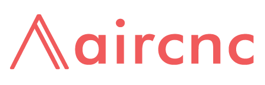
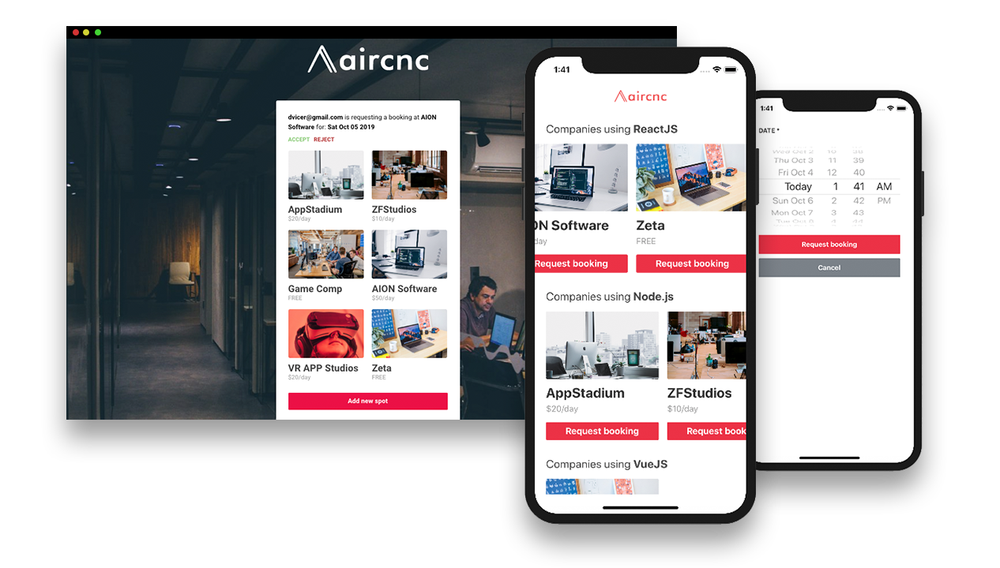

  

Airbnb like (Air Coffee &amp; Code) to booking spots for developers.

>This project was made for study purposes only and comes from Rocketseat's omnistack week crash course #9 with my own modifications

 

See it in action: https://youtu.be/XO1CqaiJmjA

 
                
<blockquote alt="[ignore]">
  
If you want to see <strong>videos played within markdown files on GitHub</strong> and more, install <a href="https://github.com/daltonmenezes/stylish-hub">Stylish-hub</a> extension and <strong>give superpowers for your GitHub</strong>.
  

</blockquote>

# Stack

- Website
  - ReactJS
  - Socket.io
  - Axios
  - \* [check package.json](/website/package.json)

- Mobile
  - React Native
  - Expo
  - Socket.io
  - Axios
  - \* [check package.json](/mobile/package.json)  

- Server
  - Node.js
  - Express
  - Socket.io
  - MongoDB
  - Mongoose
  - Multer
  - Dotenv
  - \* [check package.json](/server/package.json)

# License
[MIT License](https://github.com/daltonmenezes/aircnc/blob/master/LICENSE)
